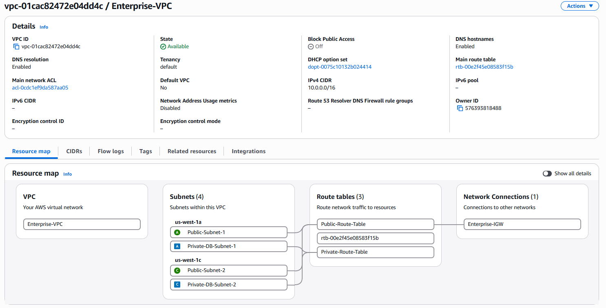
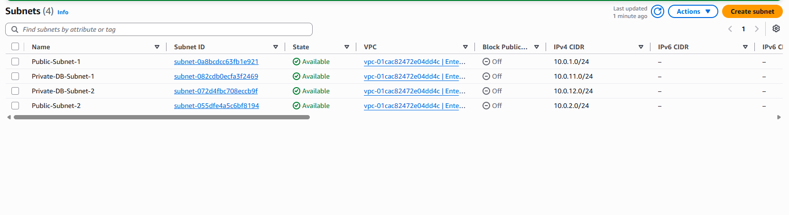
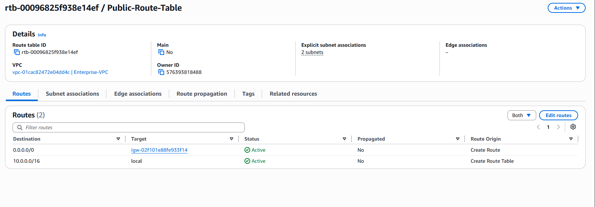
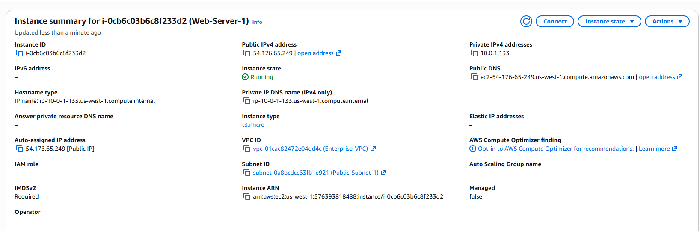
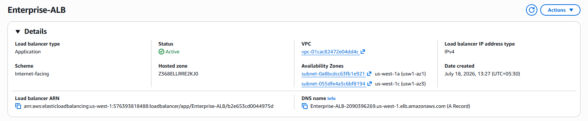
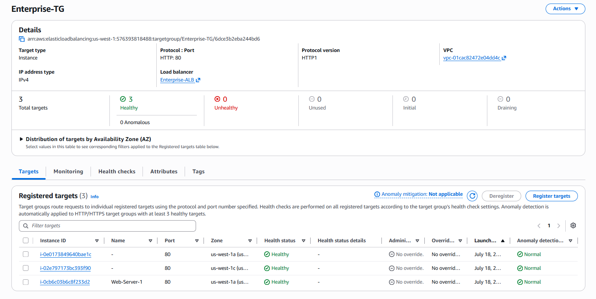
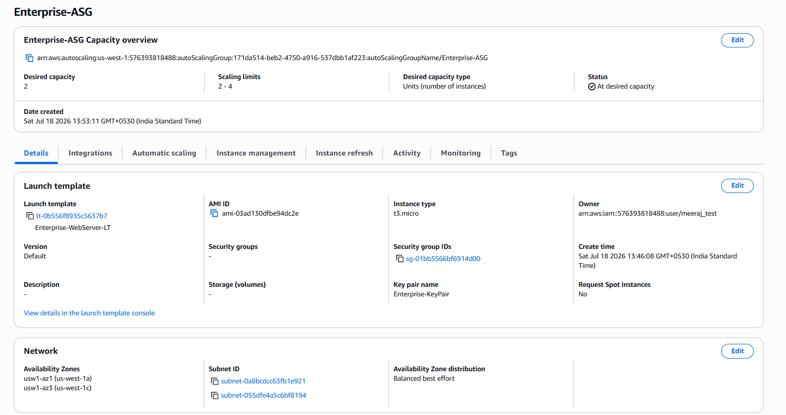
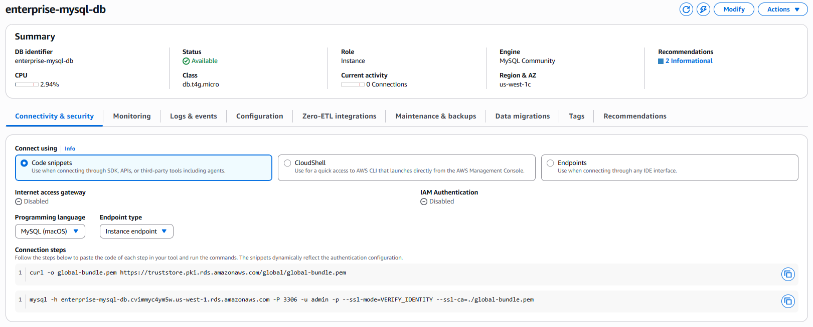
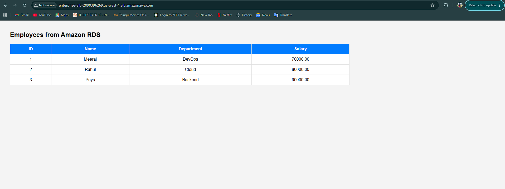

# 🚀 Enterprise 3-Tier Web Application on AWS

## 📖 Project Overview

This project demonstrates the design and deployment of a highly available **3-Tier Web Application Architecture** on **Amazon Web Services (AWS)**.

The infrastructure was built manually to gain hands-on experience with AWS networking, compute, load balancing, auto scaling, Linux administration, and database services.

The application is a PHP-based Employee Management System hosted on Amazon EC2 that retrieves employee records from an Amazon RDS MySQL database.

---

# 🏗️ Architecture

```
                    Internet
                        │
                        ▼
          Application Load Balancer
                        │
        ┌───────────────┴───────────────┐
        │                               │
        ▼                               ▼
      EC2 Instance                 EC2 Instance
     (Nginx + PHP)               (Nginx + PHP)
        │                               │
        └───────────────┬───────────────┘
                        │
                        ▼
              Amazon RDS MySQL
                 (Private Subnet)
```

---

# ☁️ AWS Services Used

- Amazon VPC
- Public Subnets
- Private Subnets
- Internet Gateway
- Route Tables
- Security Groups
- Amazon EC2
- Amazon RDS MySQL
- Application Load Balancer (ALB)
- Target Groups
- Launch Template
- Auto Scaling Group
- IAM
- Git
- GitHub

---

# ✨ Features

- Highly Available Architecture
- Dynamic PHP Web Application
- Amazon RDS Database Integration
- Load Balancing using ALB
- Auto Scaling
- Secure Network Design
- Public and Private Subnets
- Git Version Control

---

# 📂 Repository Structure

```
aws-3tier-web-application
│
├── app/
│   └── index.php
│
├── architecture/
│   └── README.md
│
├── docs/
│   └── deployment-guide.md
│
├── screenshots/
│
├── userdata/
│   └── userdata.sh
│
└── README.md
```

---

# 🔐 Security Design

- Database deployed inside Private Subnets
- Security Groups used for controlled communication
- HTTP traffic allowed through Application Load Balancer
- MySQL accessible only from EC2 instances
- SSH restricted to administrator

---

# 📸 Screenshots

## VPC



---

## Subnets



---

## Route Table



---

## EC2 Instances



---

## Application Load Balancer



---

## Target Group



---

## Auto Scaling Group



---

## Amazon RDS



---

## Application Output



---

# 🛠️ Skills Demonstrated

- AWS Networking
- Linux Administration
- Nginx
- PHP
- MySQL
- Amazon EC2
- Amazon RDS
- Auto Scaling
- Application Load Balancer
- Security Groups
- Git
- GitHub

---

# 🚀 Future Enhancements

- HTTPS using AWS Certificate Manager (ACM)
- Custom Domain with Route 53
- CloudFront CDN
- AWS CloudWatch Monitoring
- CI/CD using GitHub Actions
- Infrastructure as Code using Terraform

---

# 👨‍💻 Author

**Kakarla Meeraj**

GitHub: https://github.com/meeraj097
